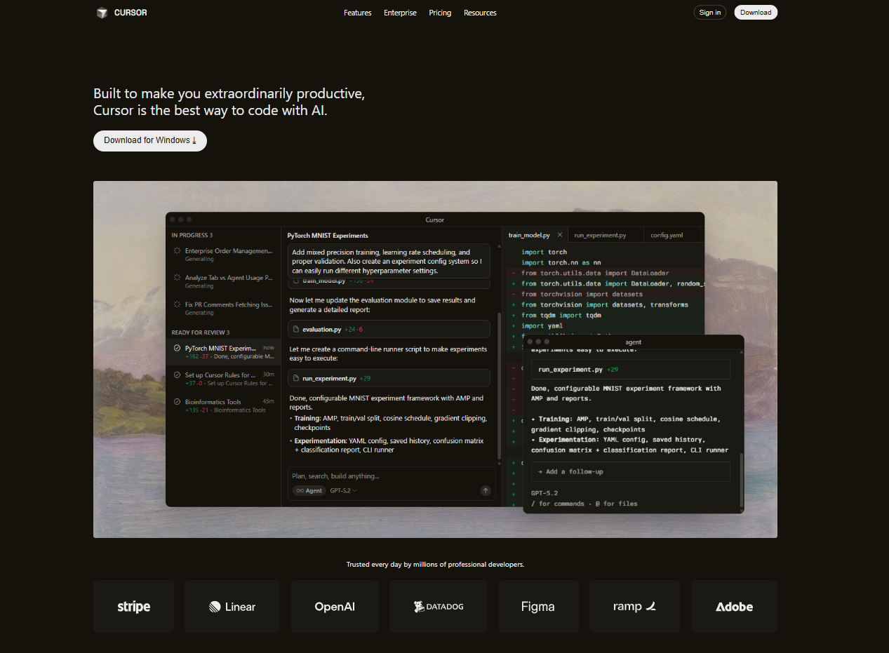
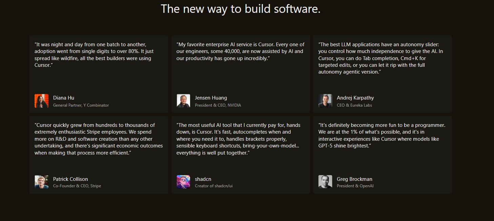
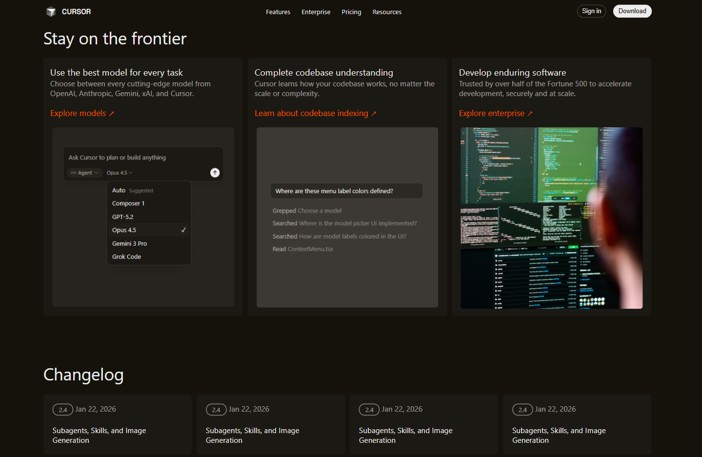

# Cursor Landing Page Clone — sxr

A **clone of the Cursor landing page** built using modern HTML, CSS  — created as part of a frontend design project.

This repo contains the source code for a landing page inspired by the official Cursor page — showcasing responsive layout, hero section, feature highlights, and UI components.

## Project Overview

This is a **static website** that replicates the landing page design of Cursor — a platform that uses AI to supercharge software development. The purpose of this clone is:

- Practice responsive design  
- Improve frontend layout skills  
- Recreate real-world landing page UI & content

---

##  Preview

